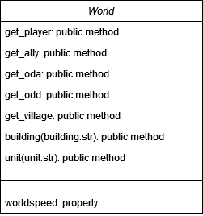

# Tribals-Wars-World-Data-Scrapper
Tribal Wars world data scrapper rekindled and updated from the old tw_bot repository. The purpose of this simple now standalone module is to create a wrapper around the tribalwars world statistics.
The module is built around a single class 'World', 7 methods and 1 property. It uses the world "br130", "pt103" as input. It should work for every country.

<p align="center">
   <p align="center"> World class diagram</p>
</p>


There are 5 fundamental data types:
- object.get_player() -> players json
- object.get_villages() -> villages data
- object.get_ally() -> alliances data
- object.get_oda() -> player offensive points data
- object.get_odd() -> player defensive points data

### object.get_player()
Template:
```json
   player_id:{
      "player_id": ,
      "name": ,
      "ally_id": ,
      "num_vill": ,
      "points":" ,
      "rank":" ,
      "datetime": 
   }
```

Results:
```json
{
   "1931":{
      "player_id":"1931",
      "name":"morteiro",
      "ally_id":"119",
      "num_vill":"1",
      "points":"54",
      "rank":"3716",
      "datetime":"2023-08-17 18:32:30.798837"
   },
   "23042":{
      "player_id":"23042",
      "name":"Ukraniano",
      "ally_id":"157",
      "num_vill":"1",
      "points":"2142",
      "rank":"1068",
      "datetime":"2023-08-17 18:32:30.798837"
   },
   "42012":{
      "player_id":"42012",
      "name":"speed7",
      "ally_id":"0",
      "num_vill":"1",
      "points":"4419",
      "rank":"592",
      "datetime":"2023-08-17 18:32:30.799807"
   }
```

### object.get_ally()
Template:
